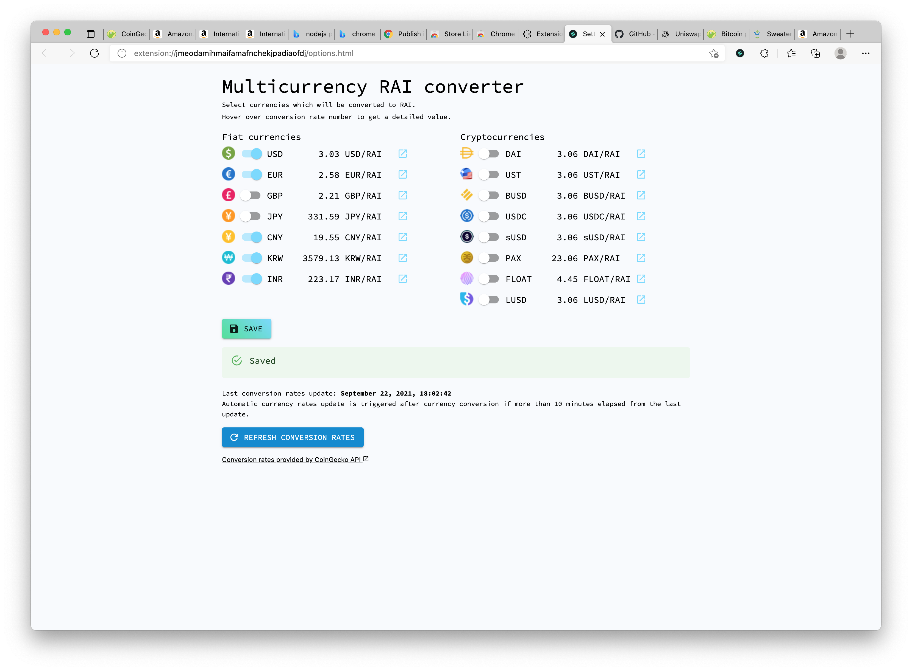
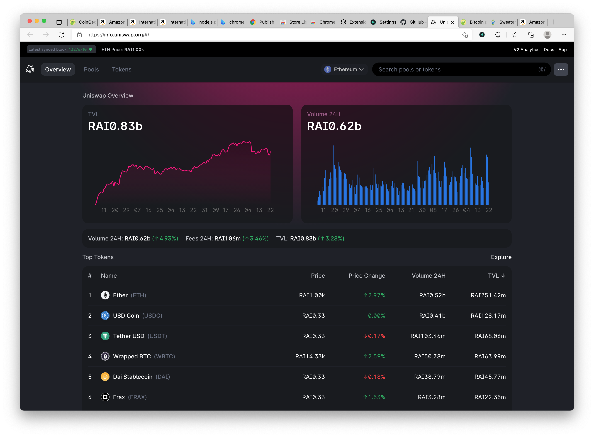
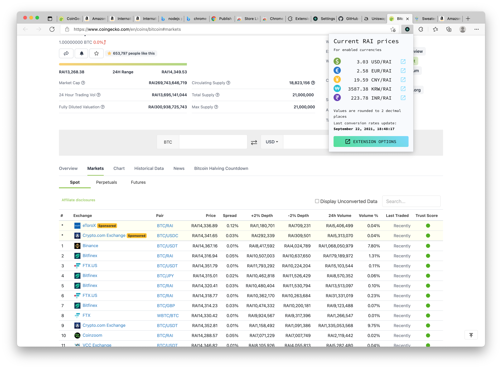

#  Multicurrency RAI

# About

Automatically converts supported currencies on the website to RAI based on current exchange rates that are automatically fetched from the CoinGecko API.

Supported currencies: EUR, CNY, JPY, GBP, KRW, INR and DAI, USDC, sUSD, USDT, PAX, UST, BUSD, LUSD and FLOAT

Each currency conversion can be turned on or off.
Exchange rates are automatically updated when user interacts with browser.
A minimal update interval is 10 minutes.

Before extension reaches Chrome Web Store you can use it by downloading ZIP from https://github.com/johnmgrimm/multicurrency-rai-chrome-extension/releases/download/v1.0.2/multicurrency-rai-chrome-extension.zip and then using `chrome://extensions/`, `Developer mode` and `Load unpacked` button point to the directory where you unpack extension files.

## Code coverage

All supported currency cases are described with automated tests.

- 90.28% Statements 864/957
- 83.33% Branches 115/138
- 90.91% Functions 30/33
- 90.28% Lines 864/957

Can be verified by running `yarn test --coverage`.

## Run locally

1. Clone this repository `git clone https://github.com/johnmgrimm/multicurrency-rai-chrome-extension.git`
2. Install dependencies `yarn install`
3. Build extension `yarn build`
4. Load your extension on Chrome:
   1. Access `chrome://extensions/`
   2. Check `Developer mode`
   3. Click on `Load unpacked extension`
   4. Select the `build` folder (the one inside this repository)
5. Open extension options page to select currencies that you would like to convert to RAI

## Live examples

Here is a list of pages where you can see how this extension works.

https://info.uniswap.org/#/

https://www.coingecko.com/en/coins/bitcoin#markets

https://demo.spreecommerce.org/t/categories/men/sweaters

https://www.amazon.com/AmazonBasics-Kids-Fleece-Tail-Blanket/dp/B0843ZL15Z/ref=sr_1_2_sspa?dchild=1&keywords=amazonbasics&pd_rd_r=8e66b431-c7f8-4aa8-bd74-66cd753242c5&pd_rd_w=fVmbd&pd_rd_wg=gWcYu&pf_rd_p=9349ffb9-3aaa-476f-8532-6a4a5c3da3e7&pf_rd_r=ZJ1AWF2X0Z1KB71D1JX0&qid=1631994058&sr=8-2-spons&spLa=ZW5jcnlwdGVkUXVhbGlmaWVyPUEyQlI3NjlEVVBDV1c4JmVuY3J5cHRlZElkPUEwNDY1OTUyMllBMkNEQ0g0RlZJVSZlbmNyeXB0ZWRBZElkPUEwNTM4NDgxMTI3MjM1QTdMVkM0RiZ3aWRnZXROYW1lPXNwX2F0ZiZhY3Rpb249Y2xpY2tSZWRpcmVjdCZkb05vdExvZ0NsaWNrPXRydWU&th=1

## Development

1. Clone this repository `git clone https://github.com/johnmgrimm/multicurrency-rai-chrome-extension.git`
2. Install dependencies `yarn install`
3. Build extension `yarn start`
4. Load your extension on Chrome:
   1. Access `chrome://extensions/`
   2. Check `Developer mode`
   3. Click on `Load unpacked extension`
   4. Select the `build` folder (the one inside this repository)

## Deployment

1. Build sources with `yarn build`
2. Prepare zip package with `yarn zip`
3. Upload zip package to Chrome Web Store

## Tests

Run `yarn test` or `yarn test:watch` to run tests continuously.

## Notes

Node v15+ is required for `replaceAll()` to work as expected in tests (https://tekloon.medium.com/how-to-fix-replaceall-is-not-a-function-in-node-js-caf459e00abf).
Make sure that you are using the right version of the NodeJS.
You may use NVM to run multiple Node versions https://github.com/nvm-sh/nvm

## Possible improvements

1. Yen and Yuan symbol looks the same, prefer one over the other
2. Consider multiple mixed matches support within one DOM node
3. Use jest-chrome to add more tests to Chrome API based functions
4. New detection flow:
   - analyze node-by-node
   - if node is empty => skip
   - else if node has only non-symbol values => skip
   - else if node has symbol value/s
     - if it has symbol only => look around for a numeric value
       (there could be an option if you should look PREV first or NEXT first)
       - if PREV node has only number
         - if PREV-PREV has coma or dot
           - get it and look for number in the prev element => convert
         - else => convert => exit
       - else if PREV node is empty => skip
       - else if PREV node has only non-number => break PREV analysis
       - else if PREV node has numbers and symbols
         - analyze content starting from the end
           - if at the end there are non-number values => break PREV analysis
           - numeric values at the end => get numeric part => convert
       - else if NEXT node has only number
         - if NEXT-NEXT has coma or dot
           - get it and look for number in the next element => convert
         - else => convert => exit
       - else if NEXT node is empty => skip
       - else if NEXT node has only non-number => break PREV analysis
       - else if NEXT node has numbers and symbols
         - analyze content starting from the beginning
       - continue with PREV children or parent-PREV
       - continue with NEXT children or parent-NEXT
       - go as deep as necessary (children first then silbings)
       - if this is the last node => exit
     - else if it has symbol-number or number-symbol only => convert
     - else (mixed values with symbol as well as random text)
       - convert every regex matching price
       - divide further on every non price element => groups are created
       - convert every group that is surrounded by non-value groups
       - analyze first group
         - if not pricelike => skip
         - else if pricelike
           - if compelete price symbol+number => convert
           - if number+symbol => look for possible remaining number parts in PREV nodes e.g. dot or coma
           - if only number => look for remaining number parts and symbol in PREV nodes
           - if only symbol => look for number in PREV nodes
       - analyze last group
         - if not pricelike => skip
         - else if pricelike
           - if compelete price number+symbol => convert
           - if symbol+number => look for possible remaining number parts in NEXT nodes e.g. dot or coma
           - if only number => look for remaining number parts and symbol in NEXT nodes
           - if only symbol => look for number in NEXT nodes

## Final notes

Extension code is based on the MIT licensed boilerplate repo https://github.com/lxieyang/chrome-extension-boilerplate-react

---

author: John Grimm
