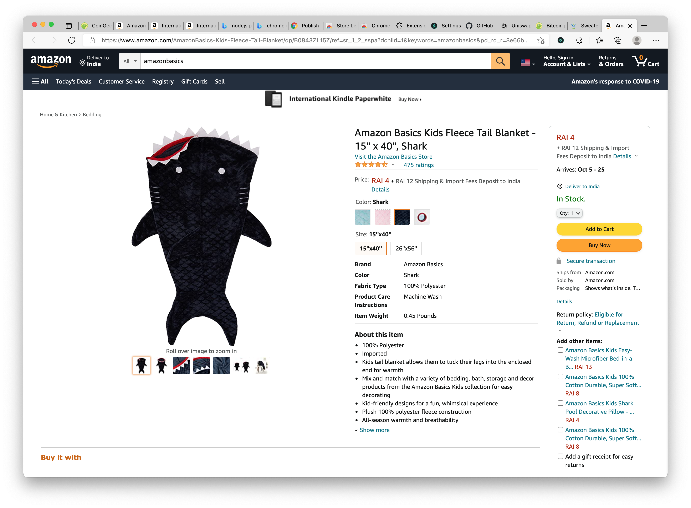

#  Multicurrency to RAI converter

# About

Automatically converts supported currencies on website to RAI based on current exchange rates automatically fetched from CoinGecko API.

Supported currencies: EUR, CNY, JPY, GBP, KRW, INR and DAI, USDC, sUSD, USDT, PAX, UST, BUSD, LUSD and FLOAT

User is able to turn on/off each currency as well as manually refresh the exchange rates data.

## Code coverage

All supported currency cases are described with automated tests.

- 90.28% Statements 864/957
- 83.33% Branches 115/138
- 90.91% Functions 30/33
- 90.28% Lines 864/957

Can be verified by running `yarn test --coverage`.

## Run locally

1. Clone this repository `git clone https://github.com/johnmgrimm/multicurrency-rai-chrome-extension.git`
2. Install dependencies `yarn install`
3. Build extension `yarn build`
4. Load your extension on Chrome:
   1. Access `chrome://extensions/`
   2. Check `Developer mode`
   3. Click on `Load unpacked extension`
   4. Select the `build` folder (the one inside this repository)
5. Open extension options page to select currencies that you would like to convert to RAI

## Live examples

Here is a list of pages where you can see how this extension works.

https://info.uniswap.org/#/

https://www.coingecko.com/en/coins/bitcoin#markets

https://demo.spreecommerce.org/t/categories/men/sweaters

https://www.amazon.com/AmazonBasics-Kids-Fleece-Tail-Blanket/dp/B0843ZL15Z/ref=sr_1_2_sspa?dchild=1&keywords=amazonbasics&pd_rd_r=8e66b431-c7f8-4aa8-bd74-66cd753242c5&pd_rd_w=fVmbd&pd_rd_wg=gWcYu&pf_rd_p=9349ffb9-3aaa-476f-8532-6a4a5c3da3e7&pf_rd_r=ZJ1AWF2X0Z1KB71D1JX0&qid=1631994058&sr=8-2-spons&spLa=ZW5jcnlwdGVkUXVhbGlmaWVyPUEyQlI3NjlEVVBDV1c4JmVuY3J5cHRlZElkPUEwNDY1OTUyMllBMkNEQ0g0RlZJVSZlbmNyeXB0ZWRBZElkPUEwNTM4NDgxMTI3MjM1QTdMVkM0RiZ3aWRnZXROYW1lPXNwX2F0ZiZhY3Rpb249Y2xpY2tSZWRpcmVjdCZkb05vdExvZ0NsaWNrPXRydWU&th=1

## Development

1. Clone this repository `git clone https://github.com/johnmgrimm/multicurrency-rai-chrome-extension.git`
2. Install dependencies `yarn install`
3. Build extension `yarn start`
4. Load your extension on Chrome:
   1. Access `chrome://extensions/`
   2. Check `Developer mode`
   3. Click on `Load unpacked extension`
   4. Select the `build` folder (the one inside this repository)

## Tests

Run `yarn test` or `yarn test:watch` to run tests continuously.

## Notes

Node v15+ is required for `replaceAll()` to work as expected in tests (https://tekloon.medium.com/how-to-fix-replaceall-is-not-a-function-in-node-js-caf459e00abf).
Make sure your are using the right version of node.
You may use NVM to run multiple Node versions https://github.com/nvm-sh/nvm

## Possible improvements

1. Yen and Yuan symbol looks the same, prefer one over the other
2. Consider multiple mixed matches support within one DOM node
3. Use jest-chrome to add more tests to Chrome API based functions

## Final notes

Extension code is based on the MIT licensed boilerplate repo https://github.com/lxieyang/chrome-extension-boilerplate-react

---

author: John Grimm
